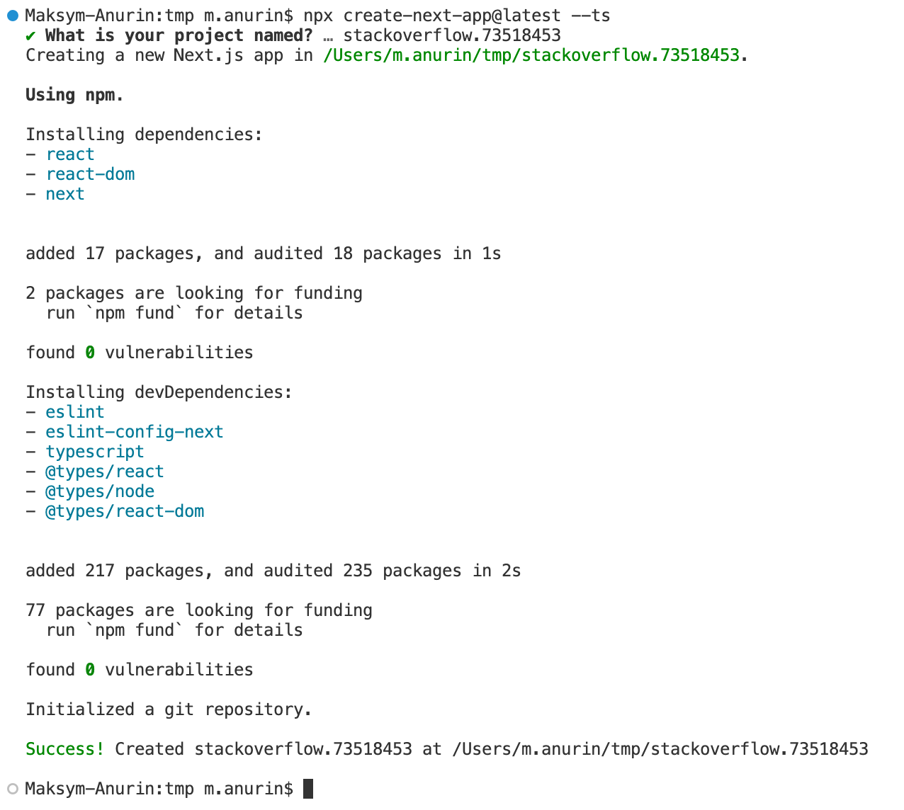
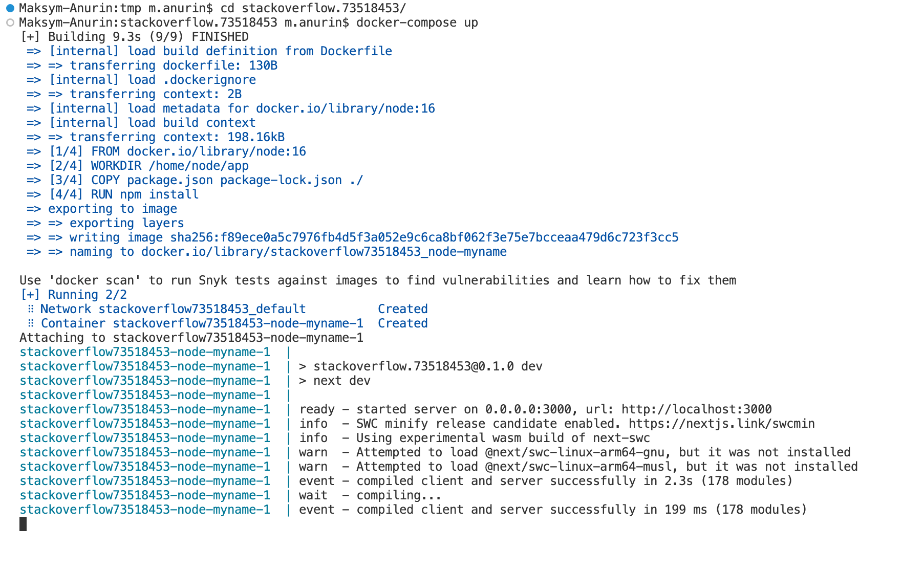
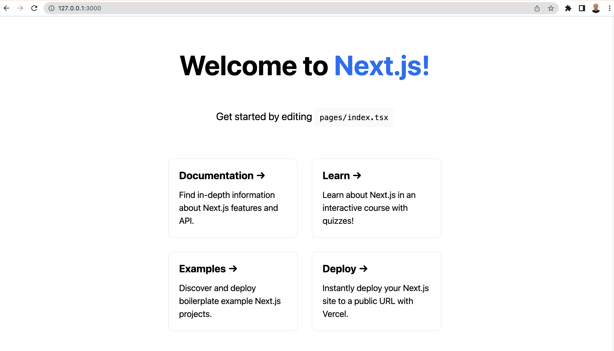
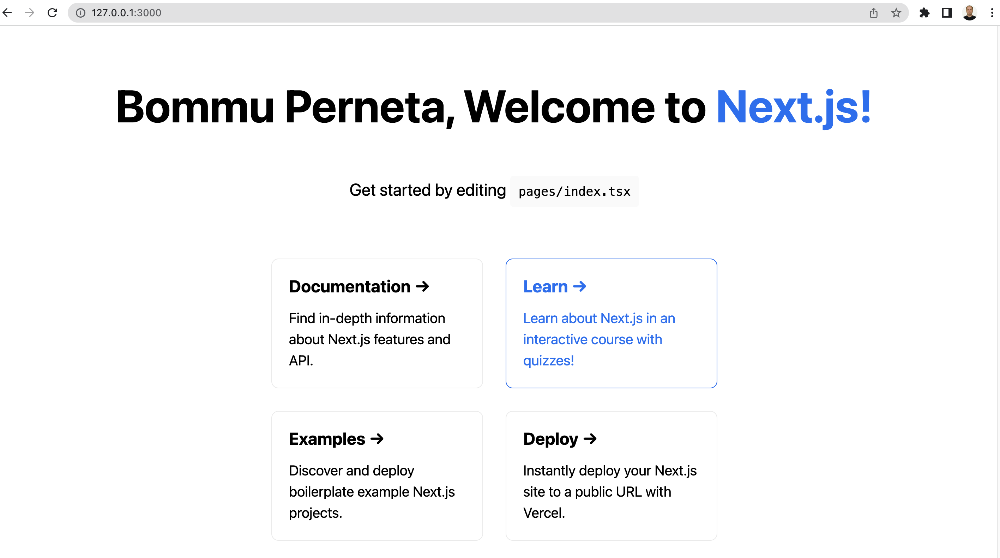

# Initalize log

1. Create a project by `npx create-next-app@latest --ts` and enter project name `stackoverflow.73518453`
    
1. Add `.devcontainer/Dockerfile` and `docker-compose.yaml` files
1. Launch Docker-Compose to start development process
    
1. Navigate browser `http://127.0.0.1:3000`
    
1. Make changes in `pages/index.tsx` ans save. Look for hot-reload page in the browser.
    

